# System Architecture - Digital Wharf Dynamics

**Visual documentation of the complete system architecture**

---

## 🏗️ High-Level Architecture

```mermaid
graph TB
    subgraph "Client Layer"
        Browser[Web Browser]
        Mobile[Mobile Browser]
    end

    subgraph "CDN & Edge"
        Netlify[Netlify CDN]
        EdgeFn[Edge Functions]
        CSP[CSP Nonce]
        UABlock[UA Blocker]
        Prerender[Prerender]
    end

    subgraph "Application Layer"
        React[React 18 SPA]
        Router[React Router]
        RQ[React Query]
        Auth0Client[Auth0 SDK]
    end

    subgraph "Serverless Functions"
        AuthFn[_auth0.ts]
        SupabaseFn[_supabase.ts]
        ContactFn[contact-submissions.ts]
        ProjectsFn[projects.ts]
        ServicesFn[services.ts]
        NewsFn[news.ts]
        NewsletterFn[newsletter.ts]
        UsersFn[admin-users.ts]
        AuditFn[audit-logs.ts]
        CCPAFn[ccpa-request.ts]
        FilesFn[files.ts]
        CheckoutFn[create-checkout.ts]
        TasksFn[project-tasks.ts]
    end

    subgraph "Authentication"
        Auth0[Auth0]
        JWT[JWT Tokens]
    end

    subgraph "Database"
        Supabase[(Supabase PostgreSQL)]
        SupabaseStorage[Supabase Storage]
    end

    subgraph "External Services"
        Stripe[Stripe API]
        PostHog[PostHog Analytics]
        Mixpanel[Mixpanel Analytics]
        GTM[Google Tag Manager]
        Intercom[Intercom Support]
        Typeform[Typeform]
    end

    Browser --> Netlify
    Mobile --> Netlify
    Netlify --> EdgeFn
    EdgeFn --> CSP
    EdgeFn --> UABlock
    EdgeFn --> Prerender
    Netlify --> React
    React --> Router
    React --> RQ
    React --> Auth0Client
    Auth0Client --> Auth0
    Auth0 --> JWT
    RQ --> AuthFn
    RQ --> SupabaseFn
    RQ --> ContactFn
    RQ --> ProjectsFn
    RQ --> ServicesFn
    AuthFn --> Auth0
    SupabaseFn --> Supabase
    ContactFn --> Supabase
    ProjectsFn --> Supabase
    ServicesFn --> Supabase
    NewsFn --> Supabase
    NewsletterFn --> Supabase
    UsersFn --> Supabase
    AuditFn --> Supabase
    CCPAFn --> Supabase
    FilesFn --> SupabaseStorage
    CheckoutFn --> Stripe
    TasksFn --> Supabase
    React --> PostHog
    React --> Mixpanel
    React --> GTM
    React --> Intercom
    React --> Typeform
```

---

## 🔄 Request Flow

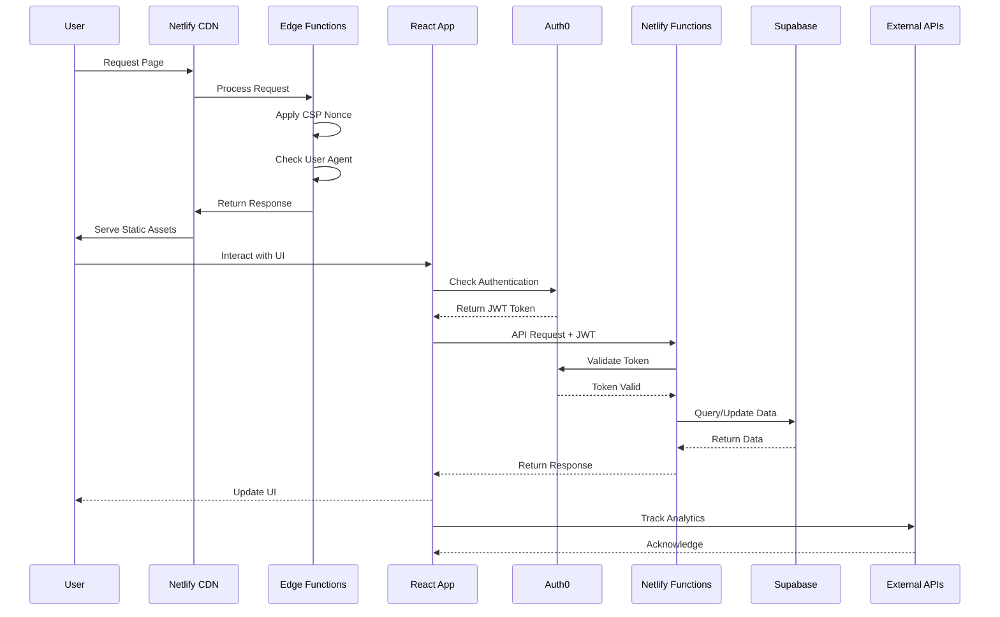

---

## 🗄️ Data Flow Architecture

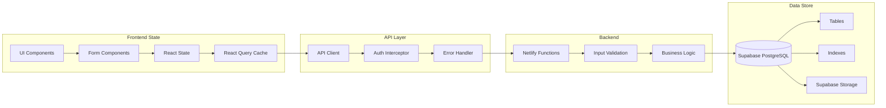

---

## 🔐 Authentication Flow

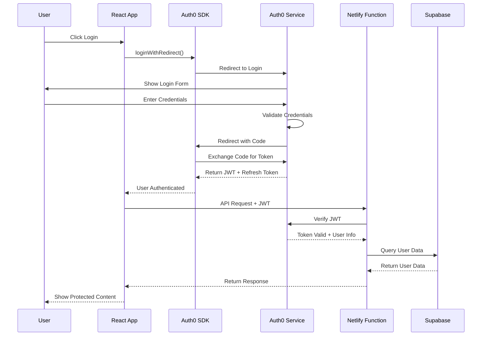

---

## 📦 Component Architecture

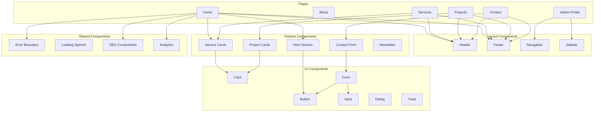

---

## 🗂️ Database Schema

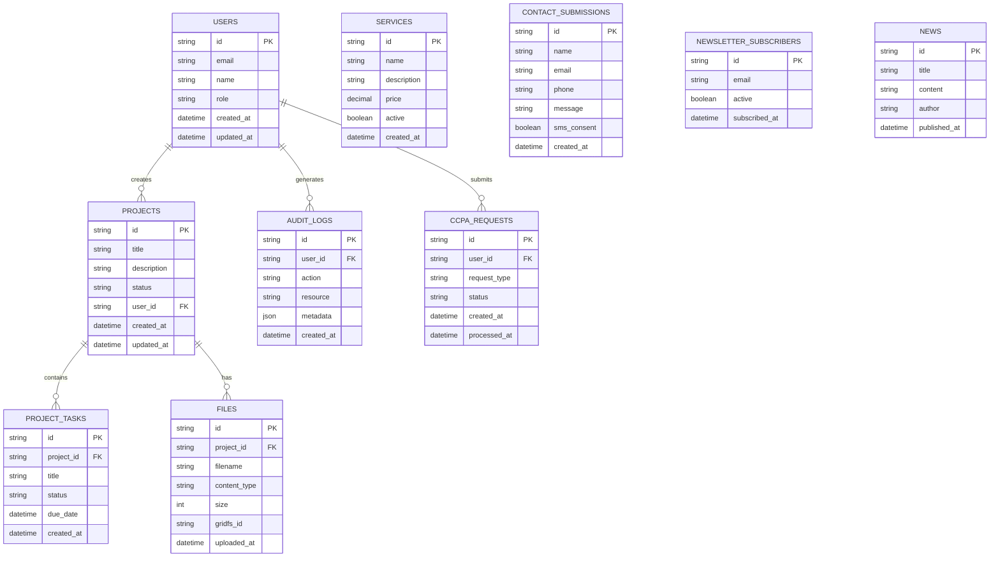

---

## 🚀 Deployment Pipeline

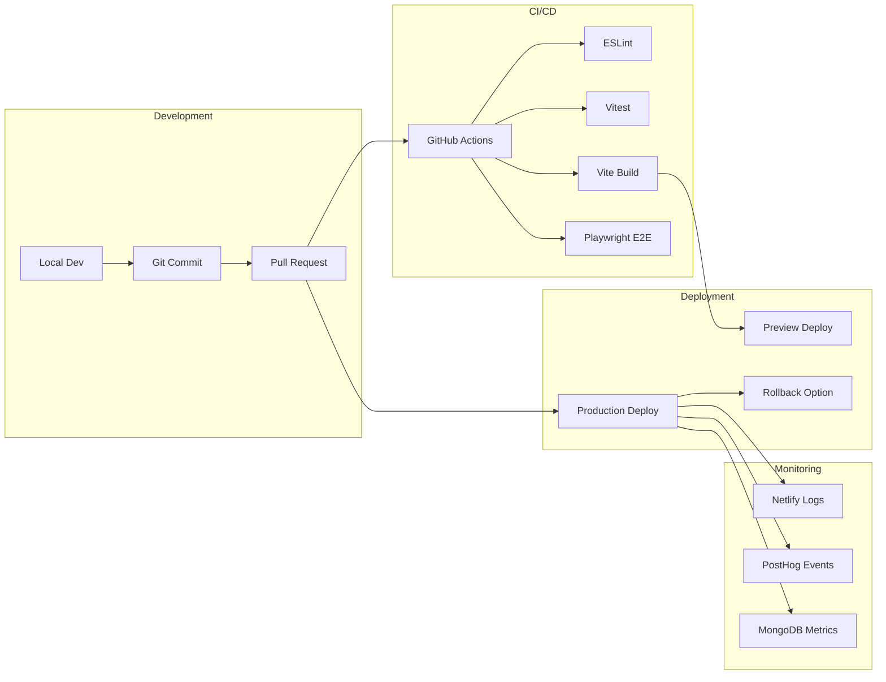

---

## 🔌 Integration Architecture

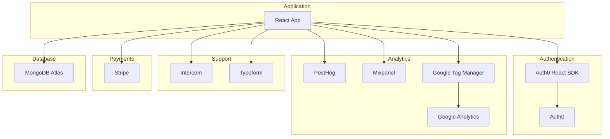

---

## 📱 Frontend Stack

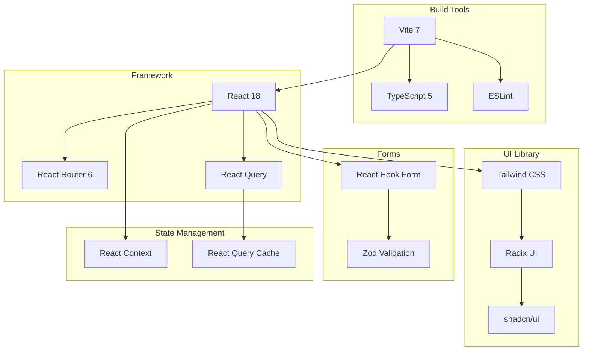

---

## 🔧 Backend Stack

```mermaid
graph TB
    subgraph "Hosting"
        Netlify[Netlify]
        CDN[Global CDN]
        Edge[Edge Functions]
    end

    subgraph "Functions"
        Node[Node.js 20]
        TS[TypeScript]
        Functions[Serverless Functions]
    end

    subgraph "Database"
        Atlas[MongoDB Atlas]
        GridFS[GridFS]
        Indexes[Indexes]
    end

    subgraph "Authentication"
        Auth0[Auth0]
        JWT[JWT Tokens]
    end

    Netlify --> CDN
    Netlify --> Edge
    Netlify --> Functions
    Functions --> Node
    Functions --> TS
    Functions --> Atlas
    Atlas --> GridFS
    Atlas --> Indexes
    Functions --> Auth0
    Auth0 --> JWT
```

---

## 🔒 Security Architecture

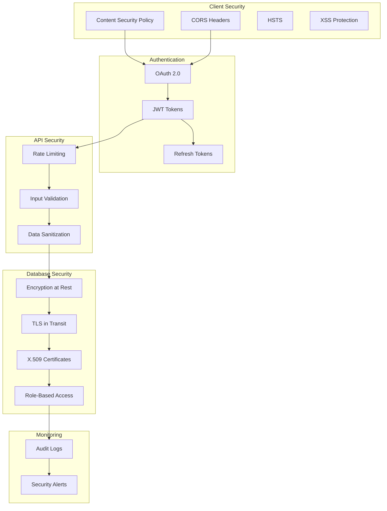

---

## 📊 Monitoring & Observability

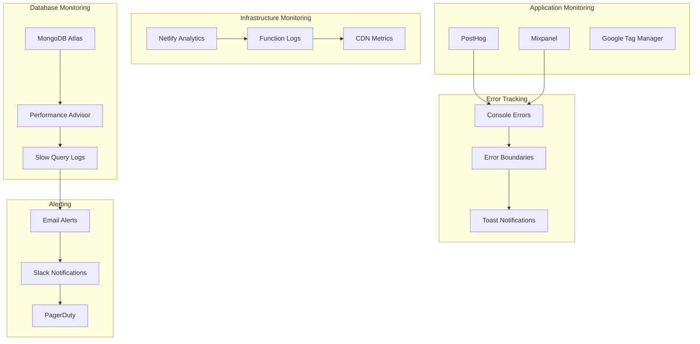

---

## 🌐 Network Architecture

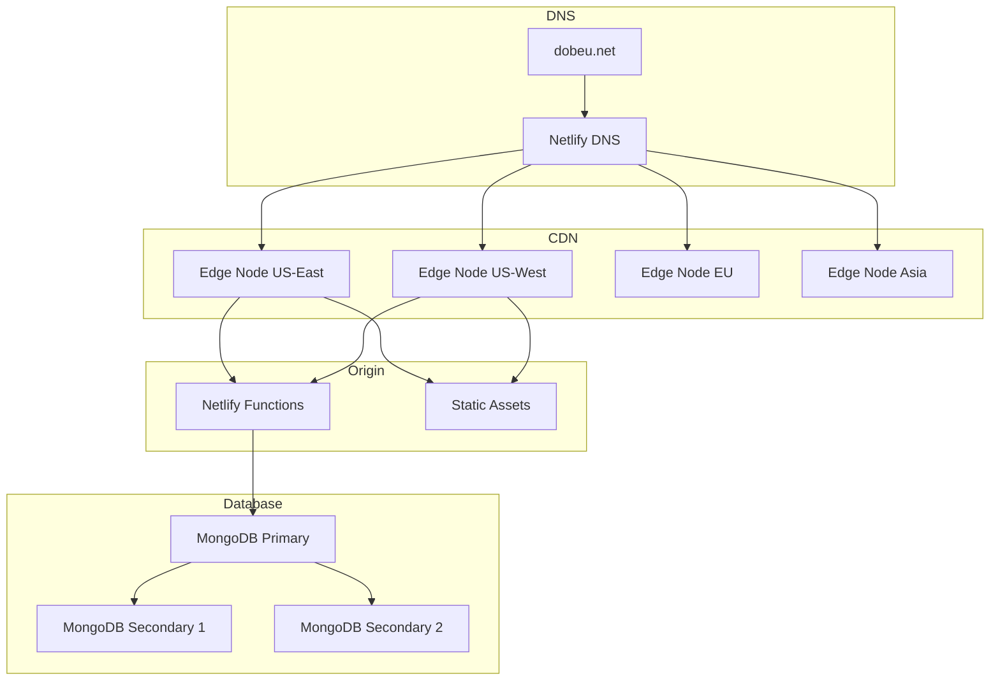

---

## 📈 Scalability Architecture

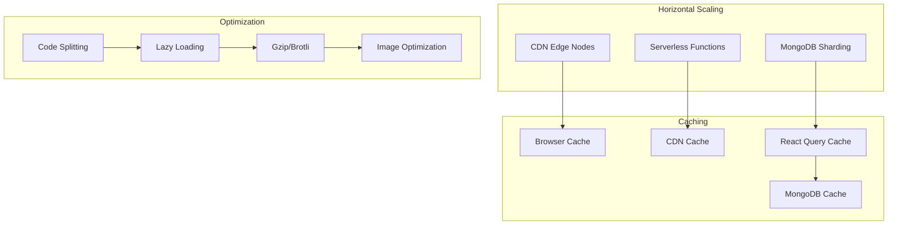

---

## 🔄 State Management Flow

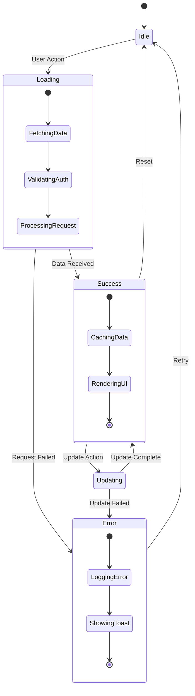

---

## 📝 Form Submission Flow

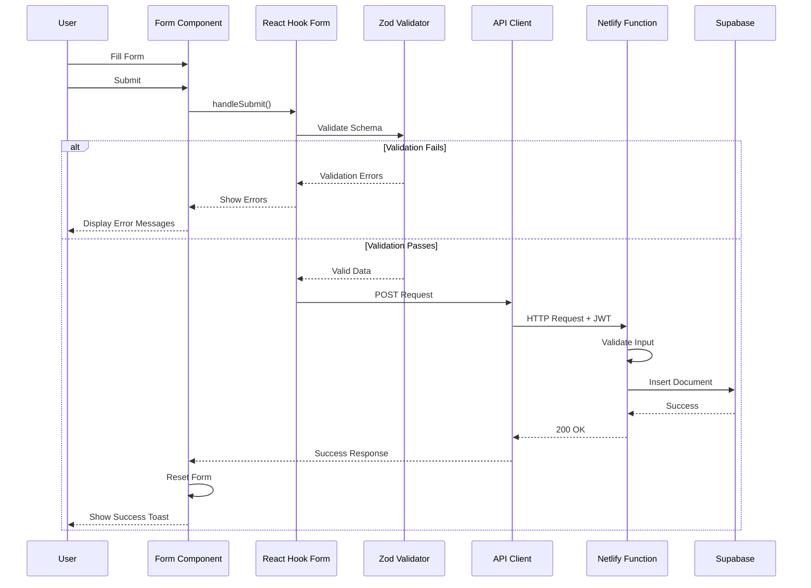

---

## 🎨 Styling Architecture

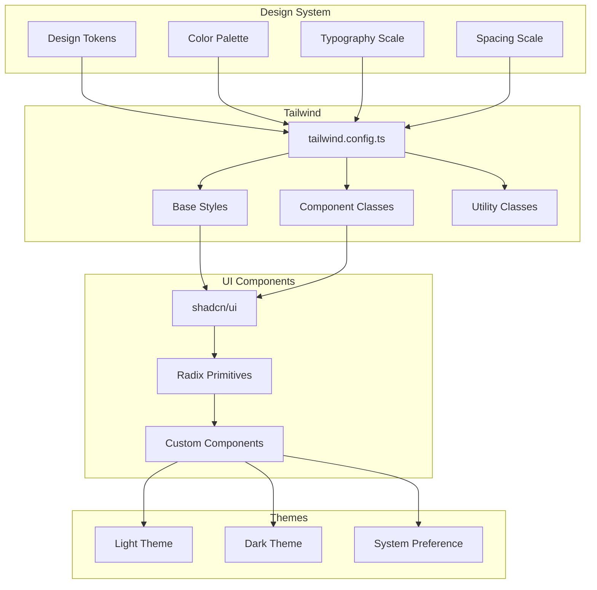

---

## 🧪 Testing Architecture

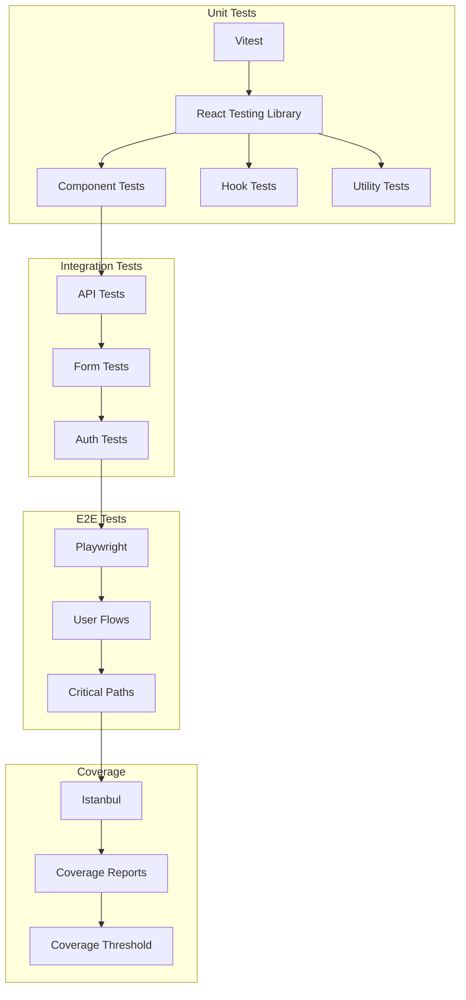

---

## 📚 Documentation Structure

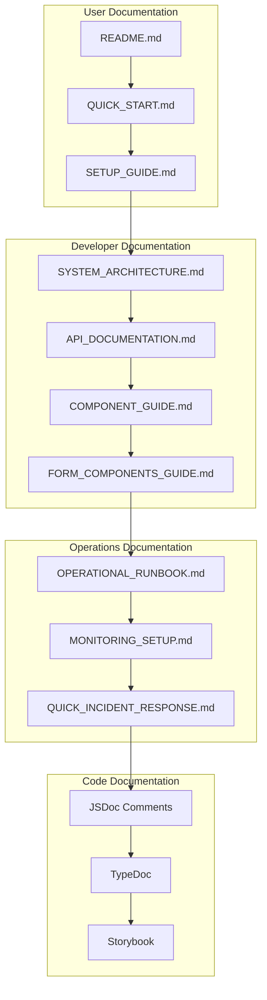

---

**Last Updated:** 2025-12-15  
**Version:** 1.0  
**Maintained By:** Engineering Team
